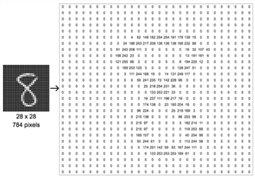

# Recognizing-Handwritten-Digits-on-MNIST-Dataset
Using k-Nearest Neighbor

## K-Nearest Neighbor Classifier from Scratch

Implementation of K-Nearest Neighbors classifier from scratch for image classification on the MNIST dataset. No existing sklearn packages were used for writing the knn code.

## Dataset

In the MNIST dataset, each sample is a picture of a handwritten digit. Each sample includes 28x28 grey-scale pixel values as features and a categorical class label out of 0-9. For more details, please refer to Dr. Yann Lecun’s page (http://yann.lecun.com/exdb/mnist/). The dataset has been imported using the sklearn.dataset package.

## Implementation

I have implemented the classifier with the L2-norm (Euclidean distance) as the distance measurement between samples. In the original dataset, the first 60,000 samples are for training, and the remaining 10,000 samples are for testing. In this implementation, I have used the first 6,000 samples from the original training set for training KNN, and the first 1,000 from the original test set for testing KNN.

## Project Structure

- `data/`: Contains the dataset files.
- `models/`: Stores the trained model.
- `notebooks/`: Contains Jupyter notebooks for data preprocessing, model training, and evaluation.
- `src/`: Contains the source code for data preprocessing, model training, and evaluation.

Key Points
Algorithm: k-Nearest Neighbors (k-NN) implemented from scratch.
Dataset: MNIST dataset with 70,000 images of handwritten digits.
Features: Each image is 28x28 pixels in grayscale.
Conclusion
The k-NN algorithm effectively classifies handwritten digits from the MNIST dataset with high accuracy. Despite being a simple and interpretable method, k-NN demonstrates robust performance in digit recognition tasks.

Results
Training Set: 6,000 samples from the original MNIST training set.
Test Set: 1,000 samples from the original MNIST test set.
Accuracy: Approximately 97%.
The k-NN classifier achieved an accuracy of around 97% on the test set, indicating its capability to accurately recognize handwritten digits.

Comparison
Support Vector Machines (SVM):

Accuracy: ~98%
Pros: Good generalization, effective in high-dimensional spaces.
Cons: Computationally intensive for large datasets.
Convolutional Neural Networks (CNN):

Accuracy: ~99.7%
Pros: State-of-the-art performance, captures spatial hierarchies in images.
Cons: Requires significant computational resources and longer training times.
Random Forests:

Accuracy: ~96-97%
Pros: Robust to overfitting, handles large datasets well.
Cons: Less interpretable, slower in prediction for large number of trees.
Conclusion
While k-NN is not the most accurate algorithm compared to advanced methods like CNNs, its simplicity, interpretability, and ease of implementation make it a valuable tool for quick and reasonably accurate handwritten digit recognition. For applications requiring higher accuracy, more sophisticated models like CNNs are recommended despite their higher computational cost. This comparison highlights the importance of selecting the appropriate model based on specific application requirements and constraints.

Contributing
Contributions are welcome! If you have any ideas, suggestions, or improvements, feel free to open an issue or submit a pull request.
